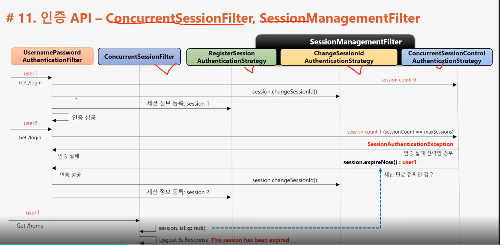

# Spring Security

SpringSecurity 5.4 이전 버전에서는 WebSecurityConfigurerAdapter를 상송받아서 configuration
SpringSecurity 5.4 이전 버전에서는 WebSecurityConfigurerAdapter를 상송받아서 configuratio file을 생성하지만
5.7버전 이후부터는 filterChain 을 사용하는 방식으로 변경되었다. 

```
@Configuration
public class SecurityConfig {
    @Bean
    public SecurityFilterChain filterChain(HttpSecurity http) throws Exception {
        http
                .authorizeHttpRequests((authz) -> authz
                        .anyRequest().authenticated()
                )
                .httpBasic(withDefaults());
        return http.build();
    }
}

``` 
## LoginForm 인증
```
UsernamePasswordAuthenticationFilter
ㄴ AntPathRequestMatcher(/login) -> 실패시 chain.doFilter
ㄴ Authentication
ㄴ AuthenticationManager
ㄴ AuthenticationProvider(인증성공)
ㄴ Authentication
ㄴ SecurityContext 저장
```
request /logout 시 server는 세션 무효화, 인증토큰 삭제, 쿠키정보삭제, 로그인페이지 리다이렉트 시키는것을 default로 한다.

### Remember-me
- 세션이 만려되고 웹 브라우저가 종료된 후에도 어플리케이션이 사용자를 기어갛느 ㄴ기능
- Remember-me 쿠키에 대한 http 요청을 확인한 후 토큰 기반 인증을 사용해 유효성을 검사하고 토큰이 검증되면 사용자는 로그인된다. 
- 사용자 life-cycle
  - 인증 성공 (Remember-Me 쿠키 설정)
  - 인증 실패 (쿠키가 존재하면 쿠키 무효화)
  - 로그아웃(쿠키가 존재하면 쿠키 무효화)


## 인증 API
### AnonymousAuthenticationFilter
- 익명사용자 인증처리필터
- 익명사용자와 인증 사용자를 구분해서 처리하기 위한 용도
- isAnonymous(), isAuthenticated()로 구분해서 사용
- 인증객체를 세션에 저장하지 않음


### 동시 세션 제어
sessionManagement() : 세션 관리 기능
```java
protected void configure(HttpSecurity http) throws Exception{
    http.sessionManagement()
        .sessionCreationPolicy(SessionCreationPolicy.If_Required)
        }
```

- SessionCreationPolicy.Always : 스프링 시큐리티가 항상 세션 생성
- SessionCreationPolicy.If_Required : 스프링 시큐리티가 필요시 생성(기본값)
- SessionCreationPolicy.Never : 스프링 시큐리티가 생성하지 않지만 이미 존재하면 사용
- SessionCreationPolicy.Stateless : 스프링시큐리티가 생성하지 않고 존재해도 사용하지 않음


### ConcurrentSessionFilter
- 매 요청마다 현재 사용자의 세션 만료 여부 체크 
- 세션이 만료되었을 경우 즉시 만료처리 
- session.isExpired() == true : 로그아웃처리, 즉시 오류페이지 응답
- 

